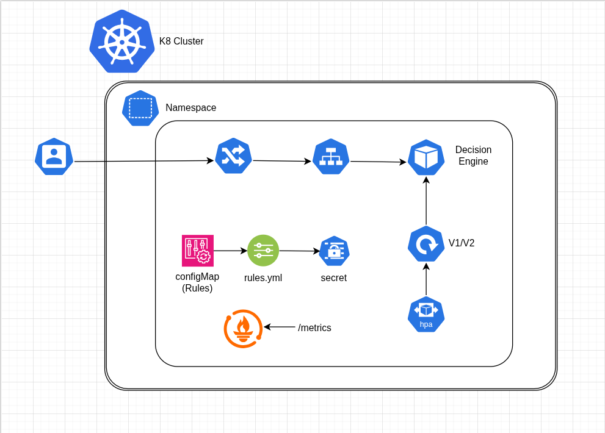
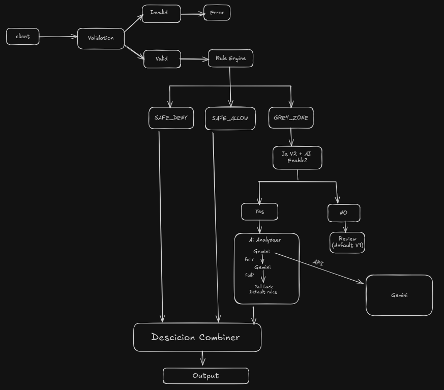

# 🎯 Decision Control Plane

Rule-first decisioning system with AI-assisted advisory for grey-zone cases

 <p align="center"> <b> Decision Control Plane is a backend-first, Kubernetes-native system designed to make real-time decisions using deterministic rules as the final authority, with AI used strictly as an advisory layer for ambiguous cases. </b> <br /> </p> <p align="center"> <em>Rules are the authority. AI is the advisor.</em> </p> 

## Core Concept

```
┌─────────────────────────────────────────────────────────────────┐
│                    DECISION FLOW                                │
├─────────────────────────────────────────────────────────────────┤
│                                                                 │
│   Input JSON ──► Rule Engine ──► SAFE_ALLOW ──► ✅ ALLOW        │
│                      │                                          │
│                      ├──► SAFE_DENY ──► ❌ DENY                 │
│                      │                                          │
│                      └──► GREY_ZONE ──► [v2 only] ──► AI ──►    │
│                               │                          │      │
│                               │         ┌────────────────┘      │
│                               │         ▼                       │
│                               └──► Combine ──► Final Decision   │
│                                                                 │
└───────-─────────────────────────────────────────────────────────┘
```

## 🔑 Key Design Principles

1. **Rules are Authoritative** - Deterministic rules always win
2. **AI is Advisory** - AI can only influence GREY_ZONE decisions
3. **AI Cannot Override Hard Rules** - SAFE_DENY is absolute
4. **Version-Controlled Logic** - v1 (rules only) vs v2 (rules + AI)
5. **Domain-Agnostic** - Works for any use case (fraud, moderation, approval, etc.)

## Architecture




## 📁 Project Structure

```
decision-control-plane/
├── 📄 Dockerfile                 
├── 📄 package.json              
├── 📄 jenkinsfile              
│
├── 📁 config/
│   └── 📄 rules.yaml             
├── 📁 src/
│   ├── 📄 server.js             
│   ├── 📄 decisionService.js     
│   │
│   ├── 📁 rules/
│   │   └── 📄 engine.js          
│   ├── 📁 ai/
│   │   ├── 📄 analyzer.js      
│   │   └── 📄 provider.js        
│   ├── 📁 routes/
│   │   ├── 📄 decision.routes.js 
│   │   ├── 📄 health.routes.js   
│   │   ├── 📄 ready.routes.js    
│   │   ├── 📄 metrics.routes.js  
│   │   ├── 📄 status.routes.js   
│   │   └── 📄 reload.routes.js   
│   ├── 📁 middleware/
│   │   ├── 📄 cors.middleware.js
│   │   ├── 📄 logging.middleware.js
│   │   ├── 📄 awareness.middleware.js
│   │   ├── 📄 notFound.middleware.js
│   │   └── 📄 errorHandler.middleware.js
│   └── 📁 metrics/
│       └── 📄 prometheus.js      
├── 📁 k8s/
│   ├── 📄 deployment-v1.yaml    
│   ├── 📄 deployment-v2.yaml    
│   ├── 📄 ingress.yaml          
│   └── 📄 monitoring.yaml  
|
└── 📁 frontend/                
    ├── 📁 src/
    │   ├── 📁 components/
    │   ├── 📁 pages/
    │   └── 📄 App.tsx
    └── 📄 package.json
```

## 🚀 Quick Start

## Decision Flow (Detailed)

1. Client sends request with request + signals

2. Rule engine evaluates rules (priority-based)

3. Outcomes:

   - SAFE_DENY → immediately denied

   - SAFE_ALLOW → immediately allowed

   - GREY_ZONE → AI advisory (v2 only)

4. AI returns:

   - Recommendation (ALLOW / DENY / REVIEW)

   - Confidence score

   - Human-readable reasoning

5. Final decision is computed using rule + AI confidence

6. If AI fails or times out → system safely falls back to rules

## Versions

### v1 — Rules Only (Stable)

- Fully deterministic

- No external dependencies

- Very low latency

- Suitable for high-throughput production traffic

### v2 — Rules + AI (Advisory)

- Same rule engine

- AI invoked only for GREY_ZONE

- AI failures do not impact availability

- Designed for controlled rollout (canary traffic)

## Why AI Is Advisory (Not Authoritative)

AI is not allowed to take final decisions because:

- AI is non-deterministic

- AI responses can vary for the same input

- AI is hard to audit

- AI hallucinations are unacceptable in risk systems

- Regulated systems require explainability

### Decision Control Plane ensures:

- Rules remain auditable

- Behavior remains predictable

- AI improves judgment, not control

### The system is fully containerized and designed for:

- Horizontal scaling

- Canary deployments

- Instant rollback

- Observability-driven decisions

## 📡 API Endpoints

````
### POST /decide
Make a decision based on input signals.

**Request:**
```json
{
  "request": {
    "amount": 5000,
    "type": "payment"
  },
  "signals": {
    "risk_score": 60,
    "source_reputation": 40,
    "is_verified": false
  }
}

````

**Response:**

```json
{
  "decision": {
    "final": "REVIEW",
    "source": "AI_RECOMMENDED",
    "confidence": 0.9
  },
  "ruleEvaluation": {
    "outcome": "GREY_ZONE",
    "matchedRule": {
      "id": "GREY_001",
      "name": "Medium risk review"
    }
  },
  "aiAnalysis": {
    "recommendation": "REVIEW",
    "confidence": 0.9,
    "reasoning": "Elevated risk score with low reputation and unverified source"
  }
}
```

### Other Endpoints
```
 | Endpoint | Method | Description                    | 
 |----------|--------|--------------------------------| 
 | /health  | GET    | Kubernetes liveness probe      | 
 | /ready   | GET    | Kubernetes readiness probe     | 
 | /metrics | GET    | Prometheus metrics             | 
 | /status  | GET    | Detailed system status         | 
 | /reload  | POST   | Hot-reload rules configuration |
 
 ```

## Observability

**The system exposes Prometheus metrics for:**

  * Decision counts (ALLOW / DENY / REVIEW)

  * Rule hit frequency

  * AI invocation rate

  * AI latency

  * Request duration

  * Error rates

**This enables:**

  * Safe AI rollout

  * Cost control

  * Performance monitoring

  * Business insights

**Key Prometheus metrics exposed:**

| Metric                                   | Type      | Description                |
| ---------------------------------------- | --------- | -------------------------- |
| `decision_platform_request_duration_ms`  | Histogram | Request latency            |
| `decision_platform_decisions_total`      | Counter   | Decision count by outcome  |
| `decision_platform_ai_invocations_total` | Counter   | AI calls (success/failure) |
| `decision_platform_ai_latency_ms`        | Histogram | AI response time           |
| `decision_platform_errors_total`         | Counter   | Error count by type        |

## 🔧 Configuration


### Supported Operators

- `eq`, `neq` - Equality
- `gt`, `gte`, `lt`, `lte` - Comparison
- `in`, `nin` - Array membership
- `exists` - Field presence
- `regex` - Pattern matching


## 🚢 Deployment Strategy

### Canary Release Flow

```
1. Deploy v2 with 1 replica
2. Configure ingress: 90% v1, 10% v2
3. Monitor metrics (error rate, latency)
4. If healthy: increase to 50% v2
5. If still healthy: promote v2 to 100%
6. If issues: rollback to v1
```

### Traffic Splitting (NGINX Ingress)

The ingress configuration uses NGINX annotations for canary:

- `canary-weight: "10"` - 10% traffic to v2
- `canary-by-header: "X-Canary"` - Force canary with header

## 📈 Use Cases

This platform can be adapted for:

- **Any domain** where you need rules + AI hybrid decisions
- **Fraud Detection** - Transaction approval/denial
- **Access Control** - Permission decisions
- **Loan Approval** - Credit decisions
- **Insurance Claims** - Claim processing
- **Content Moderation** - Post/comment filtering

What This Project Is (and Is Not)

✅ This is:

- A decision control system

- A rule-first architecture

- A production-oriented backend platform

❌ This is not:

An AI decision engine

A black-box scoring system

A replacement for domain rules

<br>
<p align="center"> Built with ☕ and a healthy respect for deterministic systems </p>
